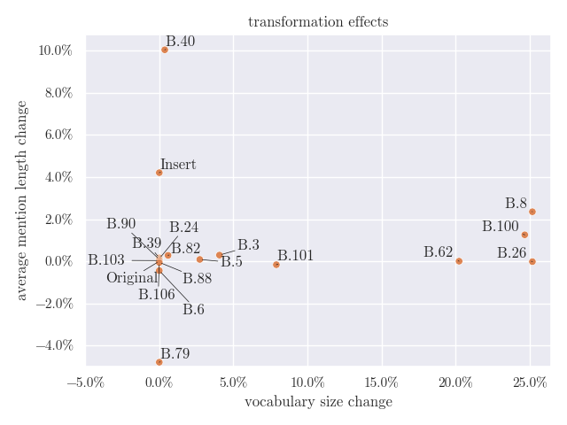

# Leveraging Data Augmentation for Process Information Extraction

Code for our paper, currently considered for acceptance at the 
36th Conference on Advanced Information Systems Engineering (CAiSE 2024).



Below you will find instructions on how to use the code.

# Install

You can either install dependencies (including the correct python version) via
mamba (recommended), *or* conda (slower). These require an installation of mamba
(https://mamba.readthedocs.io/en/latest/installation.html), or conda
(https://docs.conda.io/en/latest/miniconda.html) respectively.

Alternatively, you can install the dependencies manually via pip. In this
case please refer to the contents of env.yaml to get a list of
dependencies and python version.

Below you can find the instructions for installing dependencies with mamba.
Note, that the environment still has to be activated with `conda`.

```bash
mamba env create -f env.yaml
conda activate pet-baseline
```

Similarly, you can find instructions for installing dependencies with conda.
Beware that this may take several (> 5) minutes, depending on your machine!

```bash
conda env create -f env.yaml
conda activate pet-baseline
```

Next setup a mysql database named `pet_data_augment` and a database user
named `optuna@localhost` (no credentials, socket auth). Alternatively adjust
code in lines 193 - 198 of augmentation_experiments.py, to use e.g. Sqlite, see
https://optuna.readthedocs.io/en/stable/tutorial/20_recipes/001_rdb.html.

## Running

The command given below will run the augmentation experiments as defined in 
our paper.

```bash
conda activate pet-baseline
python -m augmentation_experiments
```

This will start the hyper-parameter optimization, which takes several days, 
depending on your machine. In our experiments the data augmentation ran for
more than five days.
