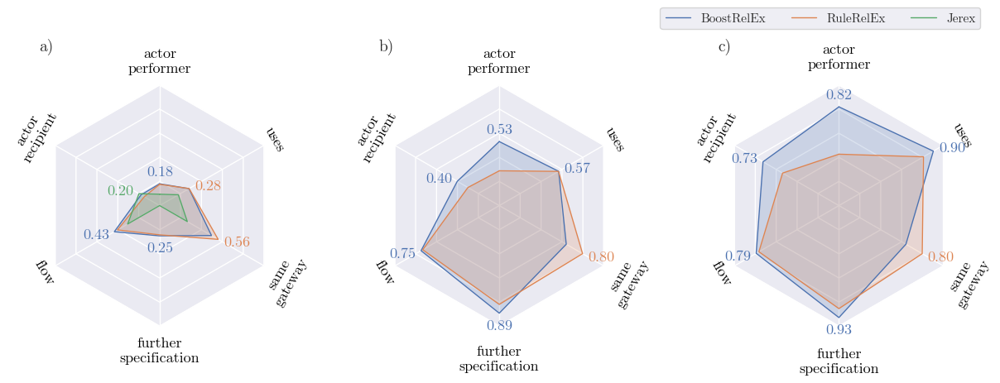

# Beyond Rule-based Named Entity Recognition and Relation Extraction for Process Model Generation from Natural Language Text

Code for our paper, currently considered for acceptance at the 
21st International Conference on Business Process Management (BPM 2023).



Below you will find instructions on how to use our proposed
method and reproduce results.

# Install

You can either install dependencies (including the correct python version) via
conda, which requires an installation of conda, e.g., 
https://docs.conda.io/en/latest/miniconda.html.

Or you can install the dependencies manually, e.g., via pip. In this
case please refer to the contents of env.yaml to get a list of
dependencies and python version.

Below you can find instructions for installing dependencies with conda.
Beware that this may take several (> 5) minutes, depending on your machine!

```bash
conda env create -f env.yaml
conda activate pet-baseline
```

Change to the directory, where this file is located, and then run 

```bash
git clone https://github.com/huggingface/neuralcoref.git
cd neuralcoref
pip install -e .
```

## Running

The command given below will run the task as defined in our paper.

```bash
conda activate pet-baseline
python main.py
```

## Reproducing Results

### Pipeline Results

To plot the figures we used in our paper, activate your conda environment
if it is not active yet:

```shell
conda activate pet-baseline
```

Afterwards run

```shell
python plot.py
```

This will give you the radar plots used to convey model performance 
in our paper.

To re-run all experiments and produce your own data for plotting, 
first delete `experiments.jerex.pkl` and `experiments.pkl`, 
then un-comment all lines in `main.py`, function `main()`

```python
def main():
    ablation_studies()
    catboost_debug()

    scenario_1()
    scenario_2_3()
    scenario_4_5_6()
```

Afterwards run (beware, this might take several hours, 
depending on your machine!)

```shell
python main.py
python add_jerex_experiments.py
python plot.py
```

You can find the updated plots in `figures/results` 

### Negative Sampling Rate

To get the analysis of optimal negative sampling rates, run

```shell
python negative_sampling.py
```

You can delete `negative_sampling_rate_data.pkl`, then un-comment line 71

```python
build_data()
```

in `negative_sampling.py`, afterwards run 

```shell
python negative_sampling.py
```

to run the negative sampling rate experiments again. While
the script trys different values for r_n, it will regularly plot
previews of the performance into `figures/hyper-opt`. Stop the script
when you feel, that it produced enough trials.

You can find the updated plots in `figures/hyper-opt` 

## Additional information

Below you will find some more information, that did not make it into
the paper.

### Hyper-parameter optimization for entity resolution module

As the neural entity resolution module effectively has two hyper-parameters,
mention overlap (alpha_m) and cluster overlap (alpha_c), we ran a
grid search hyper-parameter optimization to find optimal values.

The figure below is the result for this optimization. Brighter color
mean better F1 scores.

